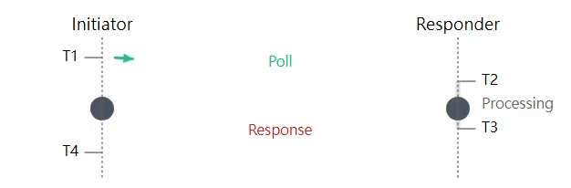
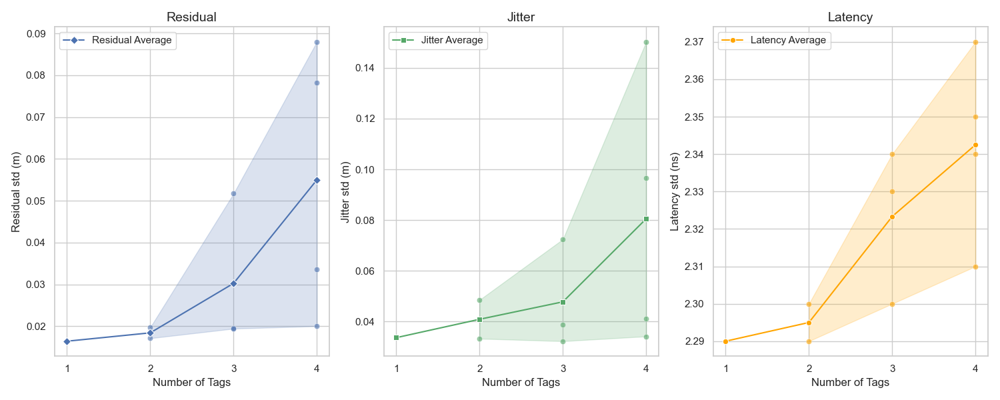
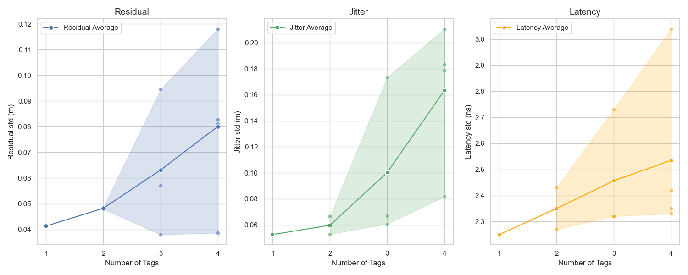
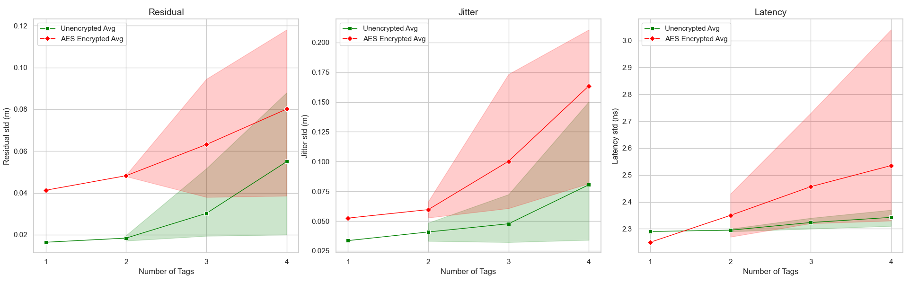
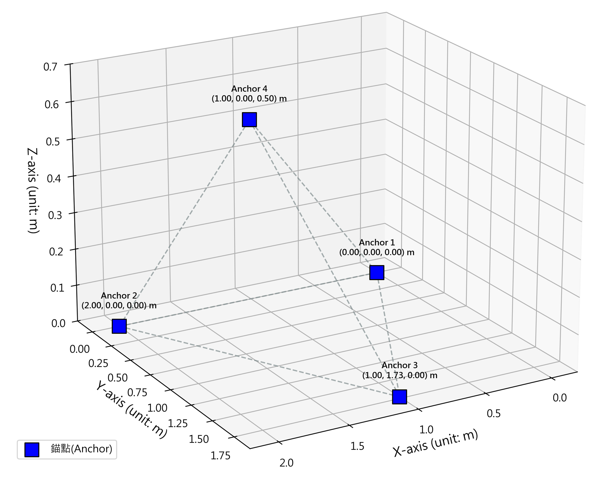
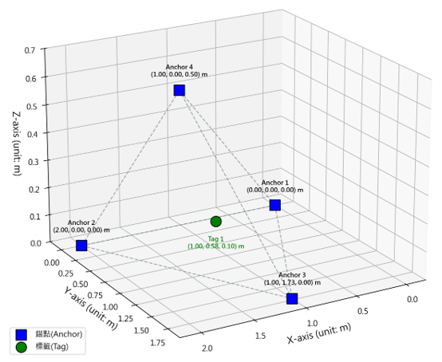

# DW3000 Ultra-Wideband Spatial Localization & Secure Transmission System

[](LICENSE) 


---
`Click the buttons below to switch languages!`

[](README.md) 
[](README.zh-TW.md)
[](README.ja.md)

---

## 📌 About This System
This project uses the `DW3000 UWB module` together with `Arduino`, `Python`, and `SS-TWR` to achieve real-time spatial localization. It incorporates `AES-CCM encryption` and `Secure Time Stamp (STS)` to ensure the confidentiality and integrity of positioning data during wireless transmission, building a secure IoT spatial localization system.

* **System Demo**

| Single-Sided Two-Way Ranging (SS-TWR) | Real-Time Spatial Localization |
| :---: | :---: |
|  <br> Two-way message exchange yields the distance between boards |  <br> 2D/3D algorithms compute the Tag's position |

* **Packet Format (Unencrypted)**

`Poll Packet`
| Field | Mac Header | Seq Num | Pan ID | Tag ShortAdr | Anc ShortAdr | Function | CRC |
| :--- | :---: | :---: | :---: | :---: | :---: | :---: | :---: |
| **Length** | 2B | 1B | 2B | 2B | 2B | 1B | 2B |
| **Value** | `41 88` | `A5` | `CA DE` | `54 31` | `41 31` | `E0` | `FA E4` |
| **Description** | MAC header | Sequence number | Network ID | Tag short address | Anchor short address | Function code (Poll) | CRC checksum |

`Response Packet`
| Field | Mac Header | Seq Num | Pan ID | Tag ShortAdr | Anc ShortAdr | Function | T2 poll_rx | T3 resp_tx | CRC |
| :--- | :---: | :---: | :---: | :---: | :---: | :---: | :---: | :---: | :---: |
| **Length** | 2B | 1B | 2B | 2B | 2B | 1B | 4B | 4B | 2B |
| **Value** | `41 88` | `00` | `CA DE` | `41 31` | `54 31` | `E1` | `59 1A 57 05` | `01 5A 26 09` | `85 2D` |
| **Description** | MAC header | Sequence number | Network ID | Tag short address | Anchor short address | Function code (Response) | Reception timestamp ($T_2$) | Transmission timestamp ($T_3$) | CRC checksum |

* **Packet Format (AES-CCM Encrypted)**

`Poll Packet`
| Field | FCF | Seq Num | Pan ID | Dst_Adr | Src_Adr | Security Control | Frame Counter | Key Index | Payload | MIC | CRC |
| :--- | :---: | :---: | :---: | :---: | :---: | :---: | :---: | :---: | :---: | :---: | :---: |
| **Length** | 2B | 1B | 2B | 8B | 8B | 1B | 4B | 1B | 12B | 16B | 2B |
| **Value** | `09 EC` | `D0` | `21 43` | `88 77...11` | `11 22...88` | `0F` | `D0 09 00 00` | `01` | `5D 9B...F5` | `EF 60...CE` | `9D 8E` |
| **Description** | Frame control | Sequence number | Network ID | Destination long address | Source long address | Security control byte | Anti-replay counter | Key index | AES-encrypted data | Message Integrity Code | CRC checksum |

---

## 🌳 Directory Tree
```bash
📂 UWB_Program_DW3000
┣ 📂 PriUint64        # uint64 printing utility library (debug)
┣ 📂 DW3000           # UWB hardware driver library
┃  ┣ 📝 dw3000.h                     # Main include header
┃  ┣ 📝 dw3000_types.h               # Data type definitions
┃  ┣ 📝 dw3000_version.h             # Driver version
┃  ┣ 📝 dw3000_regs.h                # Register addresses
┃  ┣ 📝 dw3000_vals.h                # Constants & buffer offsets
┃  ┣ 📝 dw3000_shared_defines.h      # PHY layer constants
┃  ┣ 📝 dw3000_mutex.cpp             # Mutex lock
┃  ┣ 📝 dw3000_port.h                # Arduino SPI pin configuration
┃  ┣ 📝 dw3000_config_options.h      # PHY config index table
┃  ┣ 📝 dw3000_config_options.cpp    # Config struct instances
┃  ┣ 📝 dw3000_device_api.h          # Register read/write/modify macros
┃  ┣ 📝 dw3000_device_api.cpp        # Chip-level API
┃  ┣ 📝 dw3000_mac_802_15_4.h        # MAC frame & security header definitions
┃  ┣ 📝 dw3000_mac_802_15_4.cpp      # MAC & security layer processing
┃  ┣ 📝 dw3000_shared_functions.h    # Validation utility declarations
┃  ┣ 📝 dw3000_shared_functions.cpp  # Packet pointer utilities
┃  ┣ 📝 dw3000_uart.h                # UART baud rate settings
┃  ┗ 📝 dw3000_uart.cpp              # Serial port communication
┃
┣ 📂 Draw_Error_Images  # Statistical charts output
┣ 📂 dump_file          # Miscellaneous scripts
┣ 
┣ 📂 Anchor_Encryption
┃  ┗ 📟 Anchor_Encryption.ino  # Anchor firmware (receiver)
┣ 📂 Tag_Encryption
┃  ┗ 📟 Tag_Encryption.ino     # Tag firmware (transmitter)
┣ 
┣ 🐍 2D_3D_position_display_res_jitter_ns.py  # 2D/3D positioning + residual/jitter/latency plots
┣ 🐍 2D_position_display.py                   # 2D positioning display
┣ 🐍 Draw_dis_ns.py                           # Distance/latency plot
┃
┣ 🐍 Draw_res_jitter_ns.py  # Multi-Tag residual/jitter/latency comparison
┣ 🐍 Positioning.py         # Field layout diagram
┃
┣ 🐍 Draw_packet.py         # Packet format visualizer
┣ 🐍 UDP_to_Wireshark.py    # Packet sniffer
┃
┣ 📝 README.md         # Documentation (English)
┣ 📝 README.zh-TW.md   # Documentation (Traditional Chinese)
┗ 📋 requirements.txt  # All required Python packages
```

---

## ⚙️ Prerequisites & Setup

### 1. Hardware

Install the USB driver: https://www.silabs.com/software-and-tools/usb-to-uart-bridge-vcp-drivers?tab=downloads

> Depending on your OS, choose the appropriate driver:
> - (Windows) `CP210x Universal Windows Driver`
> - (Mac) `CP210x VCP Mac OSX Driver`
>
> After installation, Arduino IDE will correctly detect the boards.

---

### 2. Arduino Setup

Copy the `DW3000` and `PriUint64` folders into the `libraries` folder:
```bash
 .\Arduino\libraries 
```

Arduino IDE board configuration:
```bash
 Tools -> Board menu 
```
| Setting | Value |
| :--- | :--- |
| **Board** | ESP32 Dev Module |
| **Port** | Depends on your USB port |
| **CPU Frequency** | 240MHz (WiFi/BT) |
| **Core Debug Level** | None |
| **Erase All Flash Before Sketch Upload** | Disabled |
| **Events Run On** | Core 1 |
| **Flash Frequency** | 80MHz |
| **Flash Mode** | QIO |
| **Flash Size** | 4MB (32Mb) |
| **JTAG Adapter** | Disabled |
| **Arduino Runs On** | Core 1 |
| **Partition Scheme** | Default 4MB with spiffs (1.2MB APP/1.5MB SPIFFS) |
| **PSRAM** | Disabled |
| **Upload Speed** | 921600 |

> If compilation fails with:
> ```cpp
> sketch_name.ino:X:XX: fatal error: XXX.h: No such file or directory
> #include <XXX.h>
>          ^~~~~~~
> compilation terminated.
> exit status 1
> Compilation error: XXX.h: No such file or directory
> ```
> Install the missing library via Arduino Library Manager or manually place it in the `libraries` folder.

---

### 3. Python Setup

In VSCode's terminal, install the required Python packages:
```bash
pip install -r requirements.txt
```
| Package | Version | Purpose |
| :--- | :--- | :--- |
| `numpy` | `2.2.6` | High-performance array & matrix operations |
| `pandas` | `2.3.1` | Data analysis & manipulation |
| `matplotlib` | `3.10.5` | Basic chart plotting |
| `seaborn` | `0.13.2` | Advanced, aesthetically pleasing statistical plots |
| `pyserial` | `3.5` | USB serial communication with ESP32 |

> If you encounter:
> ```py
> Traceback (most recent call last):
>   File "XX.py", line X, in <module>
>     import XXX
> ModuleNotFoundError: No module named 'XXX'
> ```
> Run `pip install <package_name>` in your terminal or search online for installation instructions.

---

## 📁 Firmware

### Tag_Encryption.ino

> **Role**: Actively sends Poll packets, receives Anchor replies, computes Time of Flight (ToF) and distance, and broadcasts results via serial or WiFi UDP.

#### Environment Settings

```cpp
// Total number of Tags in the system (1 ~ 4)
int totalTags = 4;

// Number of Anchors deployed in the field (1 ~ 4)
#define NUM_ANCHORS 4
```

| Parameter | Description |
| :--- | :--- |
| `totalTags` | Number of Tags for time-division scheduling; allocates time slots for each Tag |
| `NUM_ANCHORS` | Determines how many Anchors the Tag will sequentially range with; affects the `ANCHOR_LIST` array |

#### Encryption Settings

```cpp
// Tag identifier (T1 ~ T4)
const uint8_t TAG_ADDR[] = { 'T', '1' };

// Enable STS encryption
#define STS_ENCRYPTION   false  // false | true

// Enable AES-CCM encryption
#define AES_ENCRYPTION   false  // false | true

// Padding bytes (0 ~ 47)
#define Padding  0

// Random Nonce bytes (0 ~ 4)
#define Random_Nonce_Byte  0
```

| Parameter | Default | Description |
| :--- | :---: | :--- |
| `TAG_ADDR` | `'T','1'` | 2-character identifier, also used as the network short address. Name sequentially T1, T2, ... |
| `STS_ENCRYPTION` | `false` | Enables DW3000 hardware STS to encrypt/decrypt the PHR, preventing PHY-layer tampering |
| `AES_ENCRYPTION` | `false` | Encrypts the MAC Payload with AES-CCM to ensure data confidentiality |
| `Padding` | `0` | Appends meaningless bytes to the end of the packet; used for stress testing or simulating different packet sizes |
| `Random_Nonce_Byte` | `0` | Number of random bytes for the Nonce (IV). Larger values reduce collision probability but increase search time |

> **Recommended Encryption Combinations**:
> - `STS=false, AES=false`: Pure ranging mode, lowest latency
> - `STS=true, AES=false`: PHY-layer protection only, suitable when ranging accuracy is critical
> - `STS=false, AES=true`: MAC Payload encryption only, suitable when ranging results need protection
> - `STS=true, AES=true`: Dual protection (currently in testing, not recommended for production)

#### Network Settings

```cpp
// WiFi credentials
#define tmp_ssid      "SSID"
#define tmp_password  "PASSWORD"
```

#### Multi-Tag Settings

```cpp
// Time slot duration per Tag (ms)
unsigned long slotDuration = 30;

// Enable time-division mode (must be true when totalTags > 1)
#define window_mode true
```

| Parameter | Description |
| :--- | :--- |
| `slotDuration` | Each Tag's exclusive transmission window (ms). During its window, the Tag ranges with all Anchors sequentially |
| `window_mode` | `true` = time-division multiplexing, prevents collisions when multiple Tags transmit simultaneously<br>`false` = continuous ranging (single-Tag only) |

> The system time is divided into cycles of `totalTags × slotDuration`. Each Tag transmits only within its own window `(myTagID-1) × slotDuration ∼ myTagID × slotDuration` and stays idle otherwise.

---

### Anchor_Encryption.ino

> **Role**: Passively listens for Poll packets, records arrival timestamps, and transmits a Response containing both timestamps. Anchors do not compute distances; they only assist Tags in completing two-way ranging.

#### Encryption & Security Settings

```cpp
// Anchor identifier (A1 ~ A4)
const uint8_t ANCHOR_ADDR[] = { 'A', '1' };

// STS encryption (must match Tag settings)
#define STS_ENCRYPTION  false  // false | true

// AES encryption (must match Tag settings)
#define AES_ENCRYPTION  false  // false | true

// Padding bytes (must match Tag settings)
#define Padding  0
```

| Parameter | Default | Description |
| :--- | :---: | :--- |
| `ANCHOR_ADDR` | `'A','1'` | 2-character identifier. Name sequentially A1, A2, ... |
| `STS_ENCRYPTION` | `false` | Must match all Tags; otherwise STS key verification fails and packets are dropped |
| `AES_ENCRYPTION` | `false` | Must match all Tags; otherwise decryption fails |
| `Padding` | `0` | Must match the Tag's `Padding` value; mismatched packet lengths cause parsing errors |

---

## 🐍 Python Ranging Programs

### 2D_position_display.py

> Receives Tag JSON ranging data via `UDP` and displays the Tag's position in real-time on a 2D plane. Supports 3-Anchor trilateration.

#### Network Settings
```python
# Bind UDP receive IP (must be on the same subnet as the Tags)
sock.bind(('192.168.0.108', 8001))

# Physical distance between Anchors (meters)
self.distance_A1_A2 = 2.0
```

**`Features`**
- **Multi-Anchor visualization**: Blue lines connect Anchors, forming the positioning field
- **Distance circles**: Draw ranging-radius circles centered at each Anchor (toggleable)
- **EKF Kalman Filter**: Built-in Extended Kalman Filter smooths the trajectory and reduces noise
- **Raw vs. Filtered points**: Displays both raw measurement points and EKF-predicted points
- **History trail**: Shows the last 40 position trail
- **Velocity estimation**: Automatically estimates real-time speed from the EKF state vector

**`Button Controls`**
| Button | Function |
| :--- | :--- |
| `Raw` | Toggle raw measurement point display |
| `Circles` | Toggle Anchor distance circle display |
| `EKF` | Toggle Kalman filter prediction point & trail display |

---

### 2D_3D_position_display_res_jitter_ns.py

> Displays a `2D top view` and a `3D view` simultaneously, and automatically exports statistical plots for three key performance metrics: `Residual`, `Jitter`, and `Latency`.

#### Configuration
```python
CONFIG = {
    "ENABLE_STATS_EXPORT": True,   # Enable statistical export
    "SHOW_CLOUD_POINTS": True,     # Initial state: show historical path cloud
    "SHOW_RAW_POINTS": True,       # Initial state: show raw measurement points
    "SHOW_PREDICT_POINTS": False,  # Initial state: show EKF predictions & trail
    "TARGET_SAMPLES": 1000,        # Auto-save after this many samples
}
```

#### Anchor Coordinates
```python
self.anchors = {
    'A1': (0.0, 0.0, 0.0),       # Origin
    'A2': (2.0, 0.0, 0.0),       # X-axis
    'A3': (1.0, 1.732, 0.0),     # Equilateral triangle vertex
    'A4': (1.0, 0.0, 0.4),       # Z-axis (for 3D positioning)
}
```

**`Features`**
- **Dual-view synchronous display**: Left 2D top view + right 3D view
- **Multi-Tag tracking**: Supports up to 4 Tags (T1 ~ T4) simultaneously, each with a distinct color
- **3D 4-Anchor positioning**: Solves 3D coordinates via least squares (LSTSQ); requires at least 4 Anchors
- **Historical path cloud**: Accumulates all historical raw points
- **Performance metric export**: Automatically saves `Residual`, `Jitter`, and `Latency` plots when `TARGET_SAMPLES` is reached

**`Button Controls`**
| Button | Function |
| :--- | :--- |
| `Rotate` | Toggle automatic 3D view rotation |
| `Cloud` | Toggle historical path cloud display |
| `Raw` | Toggle raw measurement point display |
| `EKF` | Toggle EKF prediction point & trail display |

**`Exported Charts`**
| Chart | X-axis | Y-axis | Meaning |
| :--- | :--- | :--- | :--- |
| Residual | Sample index | Positioning residual (m) | How well raw points match Anchor distance circles; smaller = more accurate |
| Jitter | Sample index | Consecutive displacement (m) | Displacement between consecutive raw points; smaller = smoother trajectory |
| Latency | Sample index | Transmission latency (ns) | Round-trip time per ranging cycle; reflects system responsiveness |

---

### Draw_dis_ns.py 

> Reads ranging data from the serial port in real-time and plots `Distance` and `Latency` charts.

#### Configuration
```python
PORT = 'COM10'             # Serial port (depends on your USB connection)
BAUD_RATE = 115200         # Baud rate
DATA_LIMIT = 5000          # Max samples per capture session
padding = '0'              # Current test padding value (used for file naming & statistics)
encryption = 'AES_'        # Encryption mode prefix (non- / STS_ / AES_ / AES+STS_)
```

**`Features`**
- Dual-panel plots: left = distance (m), right = latency (ns)
- Automatically computes and overlays the mean (red dashed line) and standard deviation
- Supports automatic JSON export for accumulating multi-run test results

> Run the program to read data from the serial port. Once `DATA_LIMIT` samples are collected, charts are automatically saved to the `Draw_Error_Images/` folder.

---

### Draw_res_jitter_ns.py

> Manually input `Residual`, `Jitter`, and `Latency` data for multiple Tags under different encryption modes to generate comparison charts.

#### Data Input
```python
data = {
    'Tags':     [1, 2, 2, 3, 3, 3, 4, 4, 4, 4],
    'Residual': [0.0164, 0.0171, 0.0197, 0.0196, 0.0194, 0.0517, 0.0336, 0.0200, 0.0783, 0.0880],
    'Jitter':   [0.0336, 0.0485, 0.0332, 0.0386, 0.0322, 0.0724, 0.0410, 0.0341, 0.1503, 0.0966],
    'Latency':  [2.29, 2.30, 2.29, 2.30, 2.33, 2.34, 2.34, 2.35, 2.37, 2.31]
}
```

#### Display Mode
```python
section = 0  # 0 = single chart mode, 1 = comparison mode
choose  = 0  # 0 = unencrypted data, 1 = encrypted data
```

| `section` | `choose` | Output |
| :---: | :---: | :---: |
| `0` | `0` |  |
| `0` | `1` |  |
| `1` | `any` |  |

---

### Positioning\.py

> Draws a `3D field layout diagram` based on Anchor and Tag coordinates.

#### Anchor Coordinates
```python
anchors = {
    'Anchor 1': [0.00, 0.00, 0.00],    # (x, y, z) in meters
    'Anchor 2': [2.00, 0.00, 0.00],
    'Anchor 3': [1.00, 1.73, 0.00],
    'Anchor 4': [1.00, 0.00, 0.50]
}
```

#### Tag Display Setting
```python
Add_Tag = True   # False | True
```

| `Add_Tag` | Output |
| :---: | :---: |
| `False` |  |
| `True` |  |

---

## 🐍 Python Packet Tools

### Draw_packet.py

> Input a hex-format UWB packet to automatically parse its structure and draw a `packet format diagram`. Supports both DW1000 and DW3000 protocol formats.

**Supported Packet Types (DW3000)**:
| Packet Type | Identifier Condition | Description |
| :--- | :--- | :--- |
| `Poll` | Byte 10 = 0xE0 | Ranging request sent by Tag |
| `Response` | Byte 10 = 0xE1 | Ranging response from Anchor (contains timestamps) |
| `Poll AES` | FCF = 0x09, 0xEC | Poll packet with AES encryption enabled (includes security header) |

**Usage**:
```bash
python Draw_packet.py
# Then paste a hex packet string into the terminal
```

---

### UDP_to_Wireshark.py

> Listens for UDP broadcast packets and converts ranging data into a standard format for packet analysis with Wireshark.

---

## License

Apache License 2.0. See `LICENSE`.
